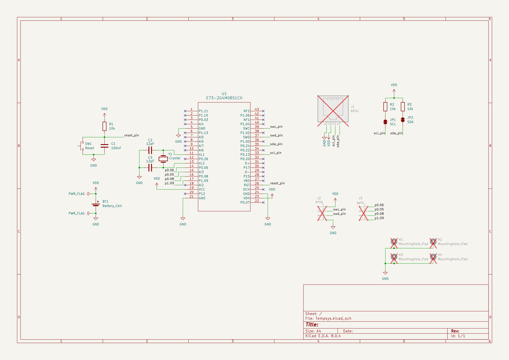
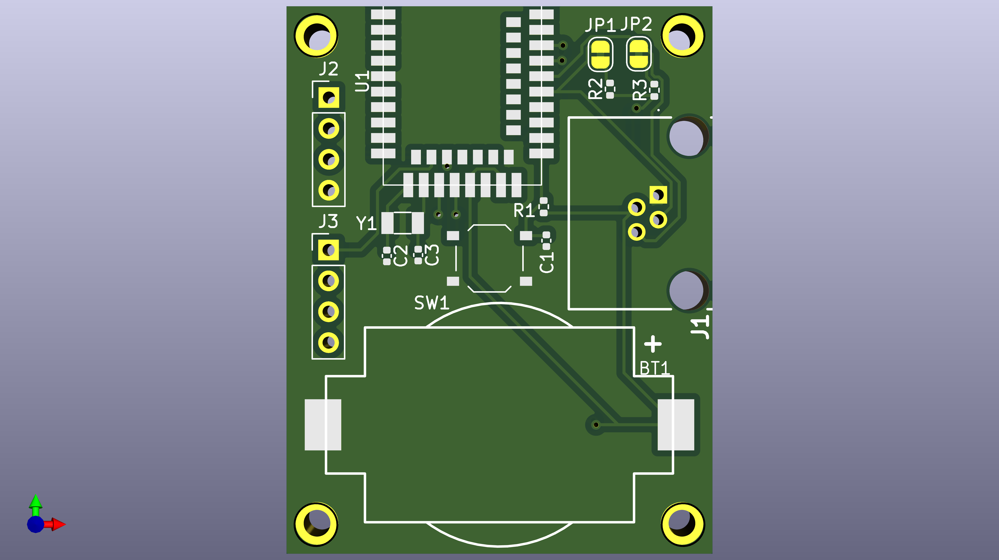
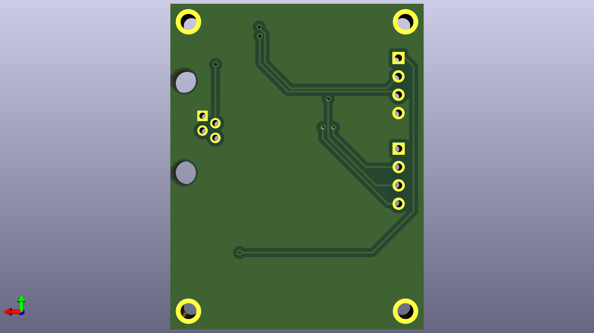
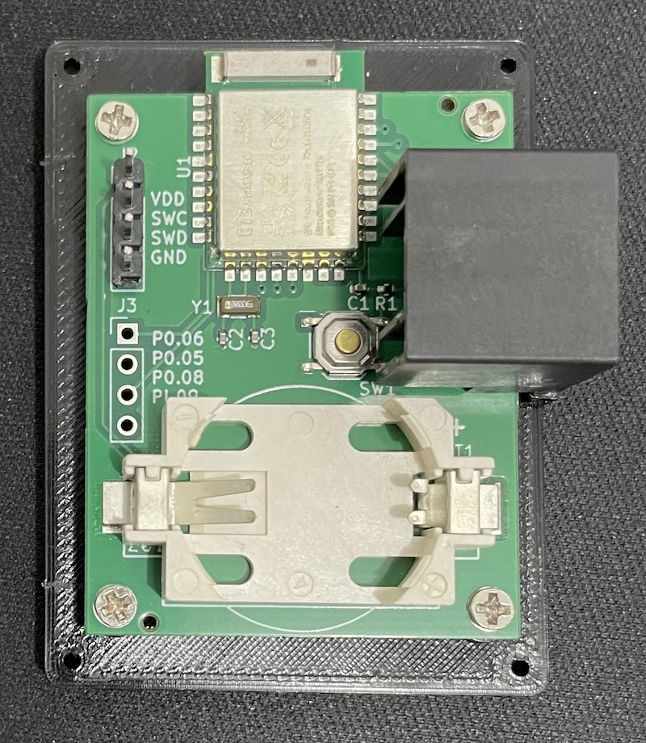
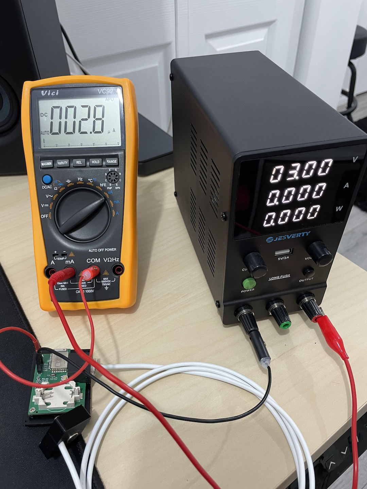

<!-- vim: set tw=80: -->

# Tempsys Hardware

Kicad hardware design for the Tempsys board.

## Block Diagram

## Schematics

The board is built around the
[E73-2G4M08S1C](https://www.cdebyte.com/products/E73-2G4M08S1C) module that
relies on the nRF52840 chip from Nordic. This was selected The hardware design
is very minimalistic to avoid any unnecessary power draw.

In short:

- An external XTAL is used to further reduce power consumption
- Pull-up resistors on the i2c bus
- Programming headers are provided.
- Reset button
- Extra GPIO headers if necessary
- CR-2032 battery holder

## PCB

 

## Assembled Product

Slight older version of the PCB without the pull-up resistors.

## Current Draw

The hardware is optimized to sip as little power as possible. Thanks to the
Nordic low power capabilities this device will run for more than a year on a
single coin cell battery CR-2032. In idle it will consume only ~3uA, and around
250uA when the Bluetooth radio is engaged.

From the [firmware](https://github.com/fabiojmendes/tempsys-firmware)
perspective, all devices are set to sleep when not in use and the advertising
rate for the Bluetooth LE is stretched as much as possible.

