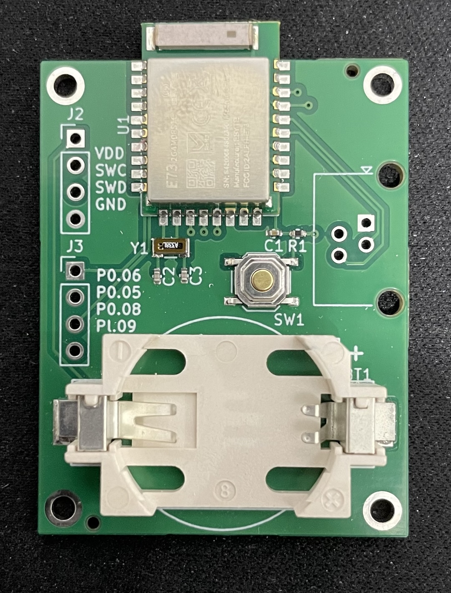

<!-- vim: set tw=80: -->

# Tempsys Hardware

Kicad hardware design for the tempsys board.

## Schematics

The hardware design is very minimalistic to avoid any unnecessary power draw.
An external XTAL is used to further reduce power consumption.

Pullup resistors on the i2c bus and programming headers are provided.

## PCB

## Assembled Product

## Current Draw

The hardware is optimized to to sip as little power as possible.
Thanks to the Nordic low power capabilities this device will run for more than
a year on a single coin cell battery CR-2032. In idle it will consume only ~3uA,
and around 250uA when the Bluetooth radio is engaged.

From the [firmware](https://github.com/fabiojmendes/tempsys-firmware)
perspective, all devices are set to sleep when not in use and
the advertising rate for the Bluetooth LE is stretched as much as possible.

